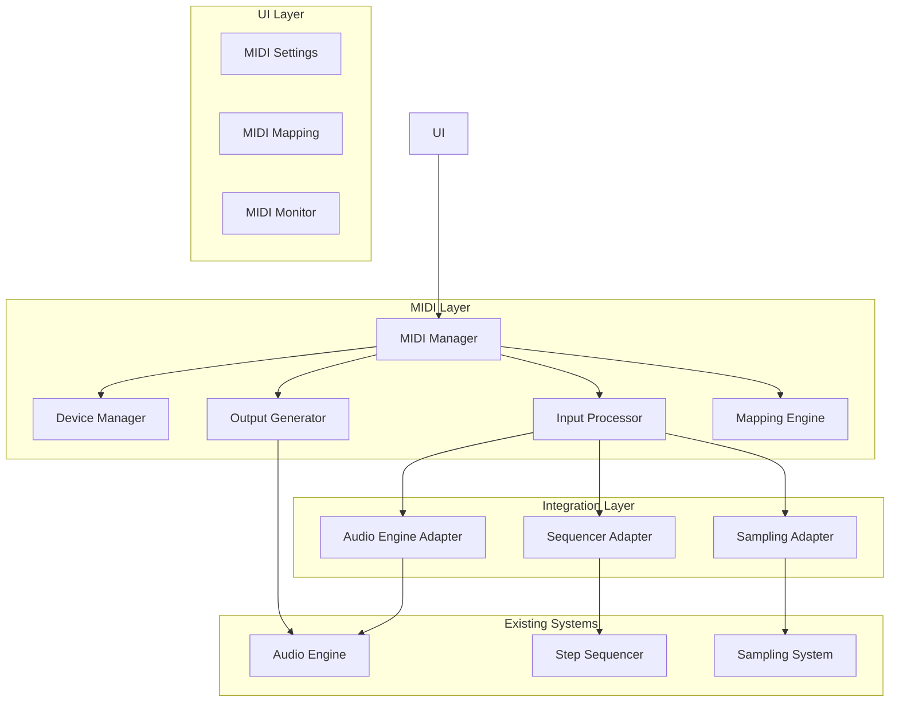

# MIDI Engine Foundation - Design Document

## Overview

The MIDI Engine Foundation provides comprehensive MIDI input/output capabilities for TheOne, enabling seamless integration with external MIDI hardware controllers, keyboards, and other MIDI devices. The design leverages Android's MIDI API (introduced in API 23) to provide low-latency, real-time MIDI processing that integrates with the existing audio engine and sampling system.

The MIDI engine follows a modular architecture that separates MIDI device management, message processing, mapping configuration, and audio engine integration. This design ensures scalability, maintainability, and optimal performance for professional music production workflows.

## Architecture

### High-Level Architecture



### Core Components

#### 1. MIDI Manager (`MidiManager`)
- Central coordinator for all MIDI operations
- Manages lifecycle of MIDI connections
- Coordinates between input processing and output generation
- Handles error recovery and device reconnection

#### 2. MIDI Device Manager (`MidiDeviceManager`)
- Discovers and manages MIDI devices
- Handles device connection/disconnection events
- Maintains device state and capabilities
- Provides device enumeration and selection

#### 3. MIDI Input Processor (`MidiInputProcessor`)
- Processes incoming MIDI messages in real-time
- Applies MIDI mapping configurations
- Routes messages to appropriate system components
- Handles velocity curves and input transformations

#### 4. MIDI Output Generator (`MidiOutputGenerator`)
- Generates MIDI output messages
- Sends MIDI clock and transport messages
- Handles MIDI echo and feedback prevention
- Manages output device routing

#### 5. MIDI Mapping Engine (`MidiMappingEngine`)
- Stores and manages MIDI mapping configurations
- Provides MIDI learn functionality
- Handles mapping conflicts and resolution
- Supports multiple mapping profiles

## Components and Interfaces

### MIDI Data Models

```kotlin
// Core MIDI message representation
data class MidiMessage(
    val type: MidiMessageType,
    val channel: Int,
    val data1: Int,
    val data2: Int,
    val timestamp: Long
)

enum class MidiMessageType {
    NOTE_ON, NOTE_OFF, CONTROL_CHANGE, PROGRAM_CHANGE,
    PITCH_BEND, AFTERTOUCH, SYSTEM_EXCLUSIVE,
    CLOCK, START, STOP, CONTINUE
}

// MIDI device information
data class MidiDeviceInfo(
    val id: String,
    val name: String,
    val manufacturer: String,
    val type: MidiDeviceType,
    val inputPortCount: Int,
    val outputPortCount: Int,
    val isConnected: Boolean
)

enum class MidiDeviceType {
    KEYBOARD, CONTROLLER, INTERFACE, SYNTHESIZER, DRUM_MACHINE, OTHER
}

// MIDI mapping configuration
data class MidiMapping(
    val id: String,
    val name: String,
    val deviceId: String?,
    val mappings: List<MidiParameterMapping>,
    val isActive: Boolean
)

data class MidiParameterMapping(
    val midiType: MidiMessageType,
    val midiChannel: Int,
    val midiController: Int,
    val targetType: MidiTargetType,
    val targetId: String,
    val minValue: Float,
    val maxValue: Float,
    val curve: MidiCurve
)

enum class MidiTargetType {
    PAD_TRIGGER, PAD_VOLUME, PAD_PAN, MASTER_VOLUME,
    EFFECT_PARAMETER, SEQUENCER_TEMPO, TRANSPORT_CONTROL
}

enum class MidiCurve {
    LINEAR, EXPONENTIAL, LOGARITHMIC, S_CURVE
}
```

### MIDI Manager Interface

```kotlin
interface MidiManagerControl {
    // Device Management
    suspend fun initialize(): Boolean
    suspend fun shutdown()
    suspend fun scanForDevices(): List<MidiDeviceInfo>
    suspend fun connectDevice(deviceId: String): Boolean
    suspend fun disconnectDevice(deviceId: String): Boolean
    
    // Input/Output Control
    suspend fun enableMidiInput(deviceId: String, enabled: Boolean): Boolean
    suspend fun enableMidiOutput(deviceId: String, enabled: Boolean): Boolean
    suspend fun setInputLatencyCompensation(deviceId: String, latencyMs: Float)
    
    // Mapping Management
    suspend fun loadMidiMapping(mappingId: String): Boolean
    suspend fun saveMidiMapping(mapping: MidiMapping): Boolean
    suspend fun setActiveMidiMapping(mappingId: String): Boolean
    suspend fun startMidiLearn(targetType: MidiTargetType, targetId: String): Boolean
    suspend fun stopMidiLearn(): MidiParameterMapping?
    
    // Clock and Sync
    suspend fun enableMidiClock(enabled: Boolean)
    suspend fun setClockSource(source: MidiClockSource)
    suspend fun sendTransportMessage(message: MidiTransportMessage)
    
    // Monitoring and Diagnostics
    fun getMidiInputFlow(): Flow<MidiMessage>
    fun getMidiOutputFlow(): Flow<MidiMessage>
    suspend fun getMidiStatistics(): MidiStatistics
}

enum class MidiClockSource {
    INTERNAL, EXTERNAL_AUTO, EXTERNAL_DEVICE
}

enum class MidiTransportMessage {
    START, STOP, CONTINUE, SONG_POSITION
}

data class MidiStatistics(
    val inputMessageCount: Long,
    val outputMessageCount: Long,
    val averageInputLatency: Float,
    val droppedMessageCount: Long,
    val lastErrorMessage: String?
)
```

### Audio Engine Integration

```kotlin
// Extension to existing AudioEngineControl interface
interface MidiAudioEngineControl : AudioEngineControl {
    // MIDI-triggered sample playback
    suspend fun triggerSampleFromMidi(
        padIndex: Int,
        velocity: Int,
        midiNote: Int,
        midiChannel: Int
    ): Boolean
    
    // MIDI parameter control
    suspend fun setParameterFromMidi(
        parameterId: String,
        value: Float,
        midiController: Int,
        midiChannel: Int
    )
    
    // MIDI clock synchronization
    suspend fun syncToMidiClock(clockPulse: MidiClockPulse)
    suspend fun handleMidiTransport(message: MidiTransportMessage)
}

data class MidiClockPulse(
    val timestamp: Long,
    val pulseNumber: Int,
    val bpm: Float
)
```

## Data Models

### MIDI Configuration Storage

```kotlin
// Persistent MIDI configuration
@Serializable
data class MidiConfiguration(
    val deviceConfigurations: Map<String, MidiDeviceConfiguration>,
    val activeMappingId: String?,
    val globalSettings: MidiGlobalSettings,
    val clockSettings: MidiClockSettings
)

@Serializable
data class MidiDeviceConfiguration(
    val deviceId: String,
    val isInputEnabled: Boolean,
    val isOutputEnabled: Boolean,
    val inputLatencyMs: Float,
    val outputLatencyMs: Float,
    val velocityCurve: MidiCurve,
    val channelFilter: Set<Int>? // null = all channels
)

@Serializable
data class MidiGlobalSettings(
    val midiThru: Boolean,
    val velocitySensitivity: Float,
    val panicOnStop: Boolean,
    val omniMode: Boolean
)

@Serializable
data class MidiClockSettings(
    val clockSource: MidiClockSource,
    val sendClock: Boolean,
    val receiveClock: Boolean,
    val clockDivision: Int,
    val syncToFirstClock: Boolean
)
```

### Real-time MIDI State

```kotlin
// Runtime MIDI state management
data class MidiRuntimeState(
    val connectedDevices: Map<String, MidiDeviceInfo>,
    val activeInputs: Set<String>,
    val activeOutputs: Set<String>,
    val currentMapping: MidiMapping?,
    val isLearning: Boolean,
    val learnTarget: MidiLearnTarget?,
    val clockState: MidiClockState
)

data class MidiLearnTarget(
    val targetType: MidiTargetType,
    val targetId: String,
    val startTime: Long
)

data class MidiClockState(
    val isReceiving: Boolean,
    val isSending: Boolean,
    val currentBpm: Float,
    val clockSource: String?,
    val lastClockTime: Long
)
```

## Error Handling

### MIDI Error Types

```kotlin
sealed class MidiError : Exception() {
    data class DeviceNotFound(val deviceId: String) : MidiError()
    data class ConnectionFailed(val deviceId: String, val reason: String) : MidiError()
    data class PermissionDenied(val permission: String) : MidiError()
    data class InvalidMessage(val message: ByteArray) : MidiError()
    data class BufferOverflow(val deviceId: String) : MidiError()
    data class ClockSyncLost(val reason: String) : MidiError()
    object MidiNotSupported : MidiError()
}
```

### Error Recovery Strategies

1. **Device Disconnection Recovery**
   - Automatic reconnection attempts with exponential backoff
   - Graceful fallback to touch input when MIDI unavailable
   - User notification with reconnection options

2. **Message Processing Errors**
   - Invalid message filtering and logging
   - Buffer overflow protection with priority queuing
   - Malformed data sanitization

3. **Clock Sync Recovery**
   - Automatic fallback to internal clock on sync loss
   - Tempo smoothing during clock transitions
   - User notification of sync status changes

## Testing Strategy

### Unit Tests

1. **MIDI Message Processing**
   - Message parsing and validation
   - Mapping engine functionality
   - Velocity curve calculations
   - Clock timing accuracy

2. **Device Management**
   - Device discovery and enumeration
   - Connection state management
   - Error handling scenarios

3. **Integration Components**
   - Audio engine adapter functionality
   - Sequencer synchronization
   - Parameter mapping accuracy

### Integration Tests

1. **End-to-End MIDI Flow**
   - MIDI input to audio output latency
   - Clock synchronization accuracy
   - Multi-device scenarios

2. **Audio Engine Integration**
   - MIDI-triggered sample playback
   - Parameter control responsiveness
   - Transport synchronization

3. **Sequencer Integration**
   - MIDI clock sync with step sequencer
   - External transport control
   - Pattern recording from MIDI

### Performance Tests

1. **Latency Measurements**
   - MIDI input to audio output latency
   - Clock jitter analysis
   - Message processing throughput

2. **Resource Usage**
   - CPU usage during MIDI processing
   - Memory allocation patterns
   - Battery impact assessment

3. **Stress Testing**
   - High message rate handling
   - Multiple device scenarios
   - Long-running stability tests

## Implementation Architecture

### Package Structure

```
com.high.theone.midi/
├── MidiManager.kt                    # Main MIDI coordinator
├── device/
│   ├── MidiDeviceManager.kt         # Device discovery and management
│   ├── MidiDeviceScanner.kt         # Android MIDI API integration
│   └── MidiDeviceState.kt           # Device state tracking
├── input/
│   ├── MidiInputProcessor.kt        # Input message processing
│   ├── MidiMessageParser.kt         # Message parsing and validation
│   └── MidiVelocityCurve.kt        # Velocity transformation
├── output/
│   ├── MidiOutputGenerator.kt       # Output message generation
│   ├── MidiClockGenerator.kt        # MIDI clock generation
│   └── MidiTransportController.kt   # Transport message handling
├── mapping/
│   ├── MidiMappingEngine.kt         # Mapping configuration engine
│   ├── MidiLearnManager.kt          # MIDI learn functionality
│   └── MidiParameterMapper.kt       # Parameter value mapping
├── integration/
│   ├── MidiAudioEngineAdapter.kt    # Audio engine integration
│   ├── MidiSequencerAdapter.kt      # Sequencer integration
│   └── MidiSamplingAdapter.kt       # Sampling system integration
├── clock/
│   ├── MidiClockManager.kt          # Clock synchronization
│   ├── MidiTempoDetector.kt         # Tempo analysis
│   └── MidiClockSmoother.kt         # Clock jitter reduction
├── repository/
│   ├── MidiConfigurationRepository.kt # Configuration persistence
│   └── MidiMappingRepository.kt      # Mapping storage
└── model/
    ├── MidiModels.kt                # Core data models
    ├── MidiConfiguration.kt         # Configuration models
    └── MidiState.kt                 # Runtime state models
```

### Native Integration

The MIDI engine will integrate with the existing C++ audio engine for optimal performance:

```cpp
// MIDI integration in AudioEngine.cpp
class MidiProcessor {
public:
    void processMidiMessage(const MidiMessage& message);
    void syncToClock(uint64_t clockTimestamp);
    void scheduleNoteEvent(int note, int velocity, uint64_t timestamp);
    
private:
    std::queue<MidiEvent> midiEventQueue_;
    std::atomic<bool> clockSyncEnabled_;
    std::atomic<float> externalTempo_;
};

// JNI bridge methods
extern "C" {
    JNIEXPORT void JNICALL
    Java_com_high_theone_midi_MidiManager_native_1processMidiMessage(
        JNIEnv* env, jobject thiz, jint type, jint channel, jint data1, jint data2, jlong timestamp);
        
    JNIEXPORT void JNICALL
    Java_com_high_theone_midi_MidiManager_native_1syncToClock(
        JNIEnv* env, jobject thiz, jlong timestamp, jfloat bpm);
}
```

### Performance Optimizations

1. **Low-Latency Processing**
   - Direct JNI integration for critical path
   - Lock-free queues for message passing
   - Priority-based message scheduling

2. **Memory Management**
   - Object pooling for MIDI messages
   - Efficient data structures for mappings
   - Minimal allocations in audio thread

3. **Threading Strategy**
   - Dedicated MIDI input thread
   - Audio thread integration for output
   - Background thread for device management

This design provides a comprehensive, professional-grade MIDI engine that integrates seamlessly with TheOne's existing architecture while maintaining the low-latency, high-performance characteristics required for professional music production.