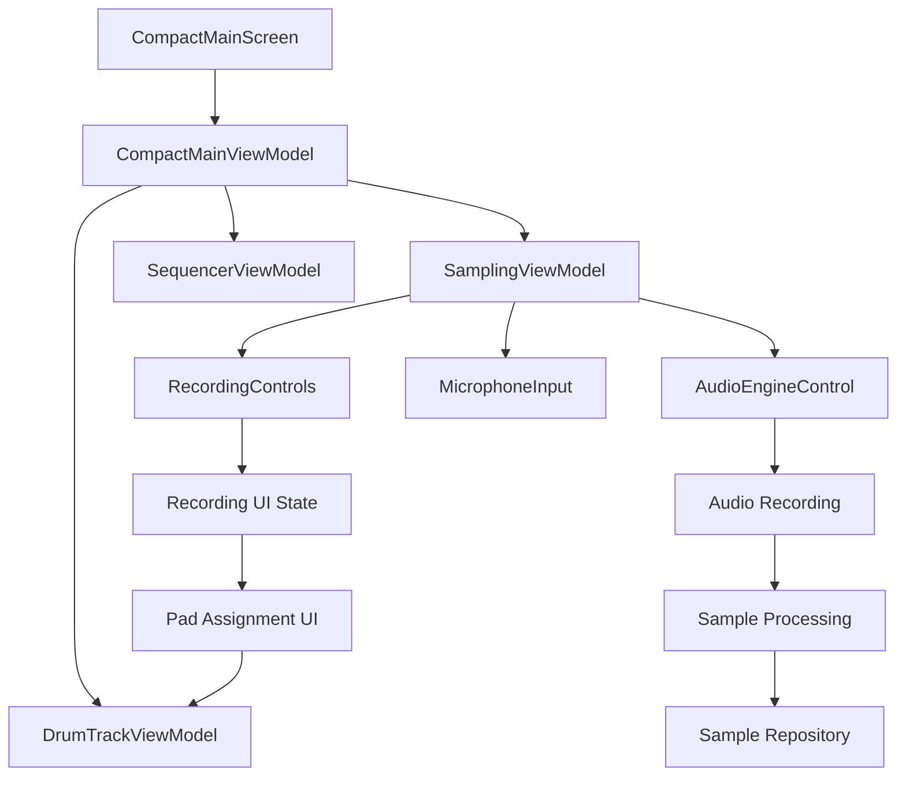
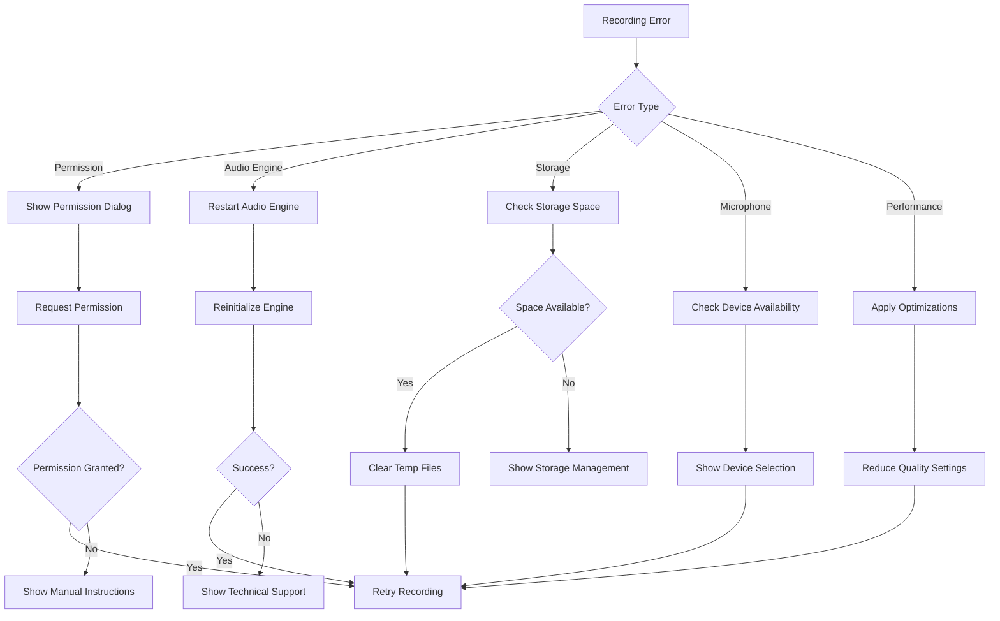

# UI Integration & Polish Design

## Overview

This design addresses the integration of existing recording functionality into the main UI and overall polish improvements. The current system has a well-implemented `SamplingViewModel` with recording capabilities, but it's not connected to the `CompactMainScreen`. This design focuses on bridging that gap and ensuring all features are accessible and polished.

## Architecture

### Current State Analysis

**Existing Components:**
- `SamplingViewModel` - Complete recording implementation
- `RecordingControls` - UI components for recording
- `MicrophoneInputImpl` - Audio input implementation  
- `CompactMainScreen` - Main UI without recording integration
- `AudioEngineControl` - Audio engine interface

**Missing Connections:**
- Recording controls not integrated into main screen
- SamplingViewModel not used by CompactMainScreen
- No direct path from recording to pad assignment

### Integration Architecture



## Components and Interfaces

### 1. Enhanced CompactMainViewModel

**Purpose:** Coordinate recording functionality with existing UI components

**New Responsibilities:**
- Integrate SamplingViewModel into main UI state
- Coordinate recording workflow with pad assignment
- Handle recording errors and recovery
- Manage recording UI state transitions

**Interface Extensions:**
```kotlin
class CompactMainViewModel {
    // New recording state
    val recordingState: StateFlow<RecordingState>
    val isRecordingPanelVisible: StateFlow<Boolean>
    
    // New recording actions
    fun startRecording()
    fun stopRecording()
    fun showRecordingPanel()
    fun hideRecordingPanel()
    fun assignRecordedSampleToPad(padId: String)
    fun discardRecording()
}
```

### 2. Recording Integration Panel

**Purpose:** Provide recording controls within the main screen layout

**Design Approach:**
- **Portrait Mode:** Slide-up panel from bottom
- **Landscape Mode:** Side panel or overlay
- **Tablet Mode:** Dedicated recording section

**Components:**
- Recording button with visual states
- Real-time level meters
- Duration display
- Quick pad assignment buttons
- Error handling UI

### 3. Enhanced Pad Assignment Flow

**Purpose:** Streamline the process of assigning recorded samples to pads

**Workflow:**
1. User records sample
2. Recording completes successfully
3. UI shows preview with waveform
4. User selects target pad (highlighted available pads)
5. Sample assigned with immediate visual feedback
6. Recording panel closes or resets for next recording

### 4. Error Handling & Recovery System

**Purpose:** Provide robust error handling with clear recovery paths

**Error Categories:**
- **Permission Errors:** Microphone access denied
- **Audio Engine Errors:** Initialization or recording failures
- **Storage Errors:** Unable to save recorded samples
- **Performance Errors:** System overload during recording

**Recovery Strategies:**
- Automatic retry with exponential backoff
- Permission request flows with clear explanations
- Fallback recording modes (lower quality if needed)
- Clear user guidance for manual resolution

## Data Models

### Enhanced Recording State

```kotlin
data class IntegratedRecordingState(
    val isRecording: Boolean = false,
    val isProcessing: Boolean = false,
    val durationMs: Long = 0L,
    val peakLevel: Float = 0f,
    val averageLevel: Float = 0f,
    val recordedSampleId: String? = null,
    val availablePadsForAssignment: List<String> = emptyList(),
    val isAssignmentMode: Boolean = false,
    val error: RecordingError? = null,
    val canStartRecording: Boolean = true
)

data class RecordingError(
    val type: RecordingErrorType,
    val message: String,
    val isRecoverable: Boolean,
    val recoveryAction: RecordingRecoveryAction?
)

enum class RecordingErrorType {
    PERMISSION_DENIED,
    AUDIO_ENGINE_FAILURE,
    STORAGE_FAILURE,
    MICROPHONE_UNAVAILABLE,
    SYSTEM_OVERLOAD
}

enum class RecordingRecoveryAction {
    REQUEST_PERMISSION,
    RETRY_RECORDING,
    RESTART_AUDIO_ENGINE,
    FREE_STORAGE_SPACE,
    REDUCE_QUALITY
}
```

### UI State Integration

```kotlin
data class EnhancedCompactUIState(
    // Existing state...
    val recordingState: IntegratedRecordingState = IntegratedRecordingState(),
    val recordingPanelState: PanelState = PanelState(),
    val quickAssignmentMode: Boolean = false,
    val performanceOptimizations: Set<OptimizationType> = emptySet()
)
```

## Error Handling

### Recording Error Recovery Flow



### Performance Optimization Strategy

**Automatic Optimizations:**
- Reduce visual effects during recording
- Pause non-essential background tasks
- Optimize memory usage for recording buffer
- Adjust audio buffer sizes based on device capability

**User-Controlled Optimizations:**
- Recording quality settings (44.1kHz vs 48kHz)
- Buffer size preferences
- Visual effect preferences
- Background app behavior

## Testing Strategy

### Integration Testing

**Recording Integration Tests:**
1. **End-to-End Recording Flow**
   - Start recording from main screen
   - Monitor level meters during recording
   - Stop recording and verify sample creation
   - Assign sample to pad and verify playback

2. **Error Recovery Tests**
   - Simulate permission denial and recovery
   - Test audio engine failure scenarios
   - Verify storage error handling
   - Test microphone unavailability

3. **Performance Tests**
   - Record while sequencer is playing
   - Test recording during high CPU usage
   - Verify memory usage during long recordings
   - Test UI responsiveness during recording

### UI Polish Testing

**Visual Feedback Tests:**
1. **Animation Smoothness**
   - Verify 60fps during normal operation
   - Test animation performance during recording
   - Validate loading state transitions

2. **Responsive Design Tests**
   - Test on various screen sizes
   - Verify landscape/portrait transitions
   - Test tablet-specific layouts

3. **Accessibility Tests**
   - Screen reader compatibility
   - High contrast mode support
   - Keyboard navigation support

### Performance Testing

**Recording Performance:**
- Latency measurements during recording
- Memory usage monitoring
- CPU usage optimization verification
- Battery usage impact assessment

**UI Performance:**
- Frame rate monitoring during all operations
- Memory leak detection
- Garbage collection impact measurement
- Startup time optimization verification

## Implementation Phases

### Phase 1: Core Integration
- Integrate SamplingViewModel into CompactMainViewModel
- Add recording controls to main screen
- Implement basic recording workflow

### Phase 2: Enhanced UX
- Add recording panel with level meters
- Implement quick pad assignment flow
- Add visual feedback and animations

### Phase 3: Error Handling
- Implement comprehensive error handling
- Add recovery flows for all error types
- Add performance monitoring and optimization

### Phase 4: Polish & Optimization
- Fine-tune animations and transitions
- Optimize performance for lower-end devices
- Add advanced recording features (trim, preview)

This design ensures that all existing functionality is properly integrated and accessible while maintaining the performance and user experience standards expected in a professional music production app.